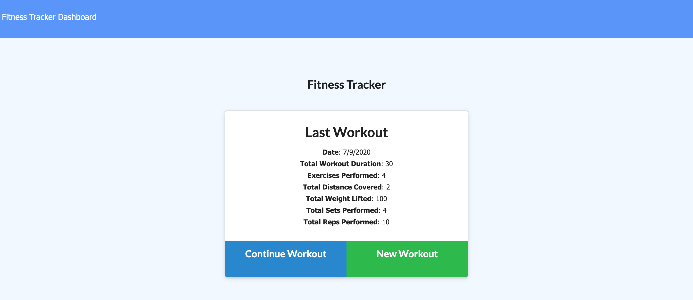
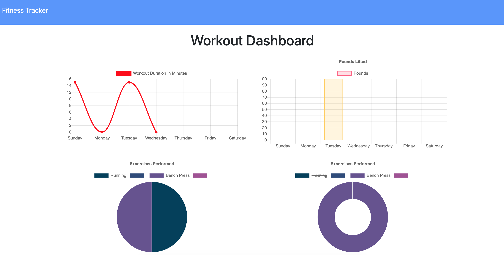

# Fitness Tracker

This application allows the user to track his/her daily workouts. The user will have option to add resistance, weight, sets, reps, and duration of exercise. If the exercise is a cardio exercise, user will be able to track the distance traveled. This application uses Mongo database with a Mongoose schema and handles routes with Express.

The user will have an option to create a new workout, or continue with their last workout.

The user will be able to:

  * Add exercises to a previous workout plan.

  * Add new exercises to a new workout plan.

  * View multiple the combined weight of multiple exercises on the `stats` page.

## User Story

* As a user, I want to be able to view create and track daily workouts. I want to be able to log multiple exercises in a workout on a given day. I should also be able to track the name, type, weight, sets, reps, and duration of exercise. If the exercise is a cardio exercise, I should be able to track my distance traveled.

## Business Context

A consumer will reach their fitness goals quicker when they track their workout progress.

Here is the [link](https://fitness-tracker-mongo.herokuapp.com/) to the deployed application.

# Technologies Used

 * HTML
 * CSS
 * Javascript
 * Moment
 * MongoDB
 * Mongoose
 * Express

